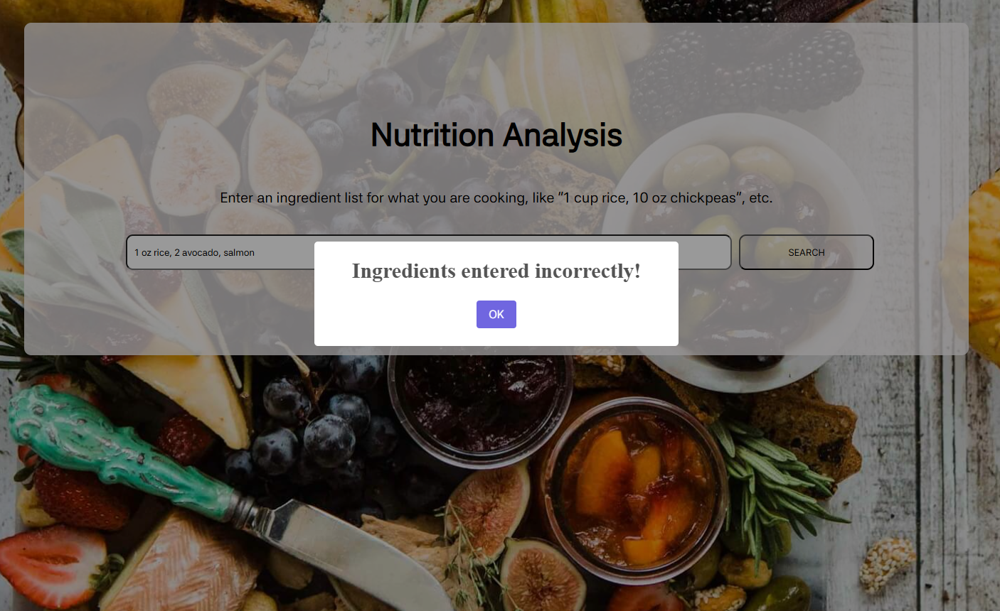

# Nutrition Analyzer  

This React-based application allows users to input ingredients (e.g., "1 potato, 200g rice") and receive detailed nutritional information, including calorie count and total nutrients. The app utilizes the **Edamam Nutrition Analysis API** to process the data.  

  
  
  

## Features  
- **POST request** to Edamam API for nutrition analysis  
- **React hooks**: `useState`, `useEffect` for state and side effects  
- **Props drilling** for passing data between components  
- **Loader** for improved UX  
- **SweetAlert** for user-friendly notifications  

## Built With

